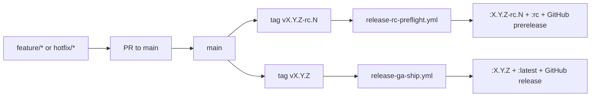

# Release Policy

本文档定义 `Avenrixa` 仓库当前采用的单长期分支发布模型、RC/GA workflow 对应关系、镜像标签规则和 PR 保护要求。

## 分支策略

- `main`
  - 唯一长期分支。
  - 所有开发分支最终都通过 PR 合并到 `main`。
  - 所有 RC tag 与 GA tag 都只能从 `main` 打出。
- `feature/<topic>`
  - 从 `main` 拉出，完成后通过 PR 回到 `main`。
- `hotfix/<topic>`
  - 从 `main` 拉出，用于正式版紧急修复。
  - 合并路径：`hotfix/* -> main`。

## Workflow 对应关系

### RC

- workflow：`.github/workflows/release-rc-preflight.yml`
- 触发：
  - `push` RC tag，例如 `v0.1.2-rc.1`
  - `workflow_dispatch`
- 约束：
  - RC tag 对应提交必须包含在 `origin/main`
  - 手动触发时当前分支必须是 `main`
- 输出：
  - RC 镜像 `ghcr.io/<owner>/avenrixa:<version>`
  - 滚动候选标签 `ghcr.io/<owner>/avenrixa:rc`
  - 对应 GitHub Pre-release（自动创建或更新）

### GA

- workflow：`.github/workflows/release-ga-ship.yml`
- 触发：
  - `push` 稳定 tag，例如 `v0.1.2`
  - `workflow_dispatch`
- 约束：
  - 稳定 tag 对应提交必须包含在 `origin/main`
  - 手动触发时当前分支必须是 `main`
  - 稳定版本号不能带预发布后缀
- 输出：
  - 正式镜像 `ghcr.io/<owner>/avenrixa:<version>`
  - 滚动正式标签 `ghcr.io/<owner>/avenrixa:latest`
  - 对应 GitHub Release 与 `dist/release/<version>` 产物附件

## 镜像标签规则

| 场景 | 来源 | 默认标签 |
| --- | --- | --- |
| RC 候选 | `main` 上的 `vX.Y.Z-rc.N` | `:X.Y.Z-rc.N`, `:rc` |
| 正式发布 | `main` 上的 `vX.Y.Z` | `:X.Y.Z`, `:latest` |

补充规则：

- 默认仓库使用当前 GitHub 仓库名的小写形式，因此 `Avenrixa` 对应 `ghcr.io/<owner>/avenrixa`。
- 本地脚本若未显式传 `RELEASE_IMAGE_REF`，会优先读取 `GITHUB_REPOSITORY`，否则退回解析 `origin` remote。
历史 tag、旧 GHCR 仓库和改名前 Release 的对应关系见 [`tag-history.md`](tag-history.md)。

## PR 保护规则

建议在 GitHub Branch Protection / Rulesets 中启用以下规则：

- `main`
  - 禁止直接 push
  - 必须通过 CI
  - 禁止绕过 conversation resolution
  - 根据仓库实际团队规模决定是否要求 reviewer；单人仓库可设为 `0`

最小必选状态检查建议：

- `ci / lint-and-test`
- `ci / compose-smoke`
- 与数据库运维链路相关的 drill workflow

## 发布节奏

1. 日常开发从 `main` 拉出短命分支。
2. 通过 PR 把开发分支合并回 `main`。
3. 需要候选版时，直接在 `main` 对应提交打 `vX.Y.Z-rc.N`。
4. RC workflow 自动校验、发布 RC 镜像并创建 GitHub Pre-release。
5. 需要正式发版时，在 `main` 对应提交打 `vX.Y.Z`。
6. GA workflow 自动校验、发布正式镜像、生成资产并创建 GitHub Release。

## 一页流程图

