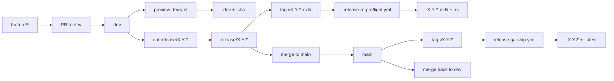

# Release Policy

本文档定义 `Avenrixa` 仓库的正式分支模型、RC/GA workflow 对应关系、镜像标签规则和 PR 保护要求。

## 分支策略

- `main`
  - 只承载已经准备正式发布的稳定代码。
  - 所有稳定 tag 只能从 `main` 打出。
- `dev`
  - 默认开发分支。
  - 所有新功能、常规修复先在这里集成。
  - 每次推送都可以产出预览镜像。
- `release/<version>`
  - 从 `dev` 切出，例如 `release/0.1.2`。
  - 进入冻结后，只允许 RC 修复、版本冻结、发布资产和 runbook 收口。
  - 所有 RC tag 只能从对应 `release/<version>` 打出。
- `feature/<topic>`
  - 从 `dev` 拉出，完成后回到 `dev`。
- `hotfix/<topic>`
  - 从 `main` 拉出，用于正式版紧急修复。
  - 合并路径：`hotfix/* -> main`，随后再回合到 `dev`。

## Workflow 对应关系

### Preview

- workflow：`.github/workflows/preview-dev.yml`
- 触发：
  - `push` 到 `dev`
  - `workflow_dispatch`
- 约束：
  - 只允许从 `dev` 执行
- 输出：
  - 预览镜像 `ghcr.io/<owner>/avenrixa:dev`
  - 提交镜像 `ghcr.io/<owner>/avenrixa:sha-<shortsha>`

### RC

- workflow：`.github/workflows/release-rc-preflight.yml`
- 触发：
  - `push` RC tag，例如 `v0.1.2-rc.1`
  - `workflow_dispatch`
- 约束：
  - RC tag 对应提交必须包含在 `origin/release/<base_version>`
  - 手动触发时当前分支必须是 `release/*`
- 输出：
  - RC 镜像 `ghcr.io/<owner>/avenrixa:<version>`
  - 滚动候选标签 `ghcr.io/<owner>/avenrixa:rc`

### GA

- workflow：`.github/workflows/release-ga-ship.yml`
- 触发：
  - `push` 稳定 tag，例如 `v0.1.2`
  - `workflow_dispatch`
- 约束：
  - 稳定 tag 对应提交必须包含在 `origin/main`
  - 手动触发时当前分支必须是 `main`
  - 稳定版本号不能带预发布后缀
- 输出：
  - 正式镜像 `ghcr.io/<owner>/avenrixa:<version>`
  - 滚动正式标签 `ghcr.io/<owner>/avenrixa:latest`

## 镜像标签规则

| 场景 | 来源 | 默认标签 |
| --- | --- | --- |
| 开发预览 | `dev` push | `:dev`, `:sha-<shortsha>` |
| RC 候选 | `release/*` 上的 `vX.Y.Z-rc.N` | `:X.Y.Z-rc.N`, `:rc` |
| 正式发布 | `main` 上的 `vX.Y.Z` | `:X.Y.Z`, `:latest` |

补充规则：

- 默认仓库使用当前 GitHub 仓库名的小写形式，因此 `Avenrixa` 对应 `ghcr.io/<owner>/avenrixa`。
- 本地脚本若未显式传 `RELEASE_IMAGE_REF`，会优先读取 `GITHUB_REPOSITORY`，否则退回解析 `origin` remote。
- `:dev` 只属于开发预览，不再由 RC workflow 复用。

历史 tag、旧 GHCR 仓库和改名前 Release 的对应关系见 [`tag-history.md`](tag-history.md)。

## PR 保护规则

建议在 GitHub Branch Protection / Rulesets 中启用以下规则：

- `main`
  - 禁止直接 push
  - 至少 1 个 reviewer
  - 必须通过 CI
  - 必须线性可追溯，推荐 merge commit 保留 release 上下文
  - 禁止绕过 conversation resolution
- `dev`
  - 禁止直接 push
  - 必须通过 CI
  - 至少 1 个 reviewer
  - 允许 squash merge
- `release/*`
  - 禁止直接 push
  - 必须通过 CI
  - 必须通过 RC 相关检查
  - 仅允许发布负责人合并

最小必选状态检查建议：

- `ci / lint-and-test`
- `ci / compose-smoke`
- 与数据库运维链路相关的 drill workflow

## 发布节奏

1. 日常开发全部进入 `dev`。
2. 需要收口版本时，从 `dev` 切出 `release/<version>`。
3. 在 `release/<version>` 上冻结版本、补 RC 修复、打 RC tag。
4. RC 验证通过后，把 `release/<version>` 合并到 `main`。
5. 在 `main` 打 GA tag，产出正式镜像和发布资产。
6. 把 `main` 回合到 `dev`，继续下一轮开发。

## 一页流程图

